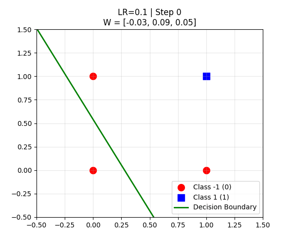
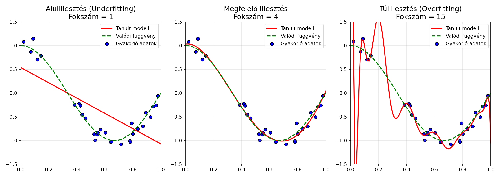

// ...existing code...
python 16_nn_architecture_comparison_animation.py
# ... stb.
```

Minden script PNG ábrákat generál az aktuális mappába.

## Vizualizációk (Galéria)

A lefuttatott scriptek számos látványos statikus és animált ábrát generálnak, amelyek bemutatják a neurális hálózatok különböző tulajdonságait:

### 1. Architektúrák, Perceptron és Döntési Határok



### 2. Optimalizálók, Gradiens Ereszkedés és Hibafüggvények


### 3. Backpropagation és Súlyok Evolúciója


### 4. Overfitting, Regularizáció és Normalizáció



### 5. Tanulási Ráták és Elrontott Folyamatok


### 6. Egyedi és Biológiai Modellek


